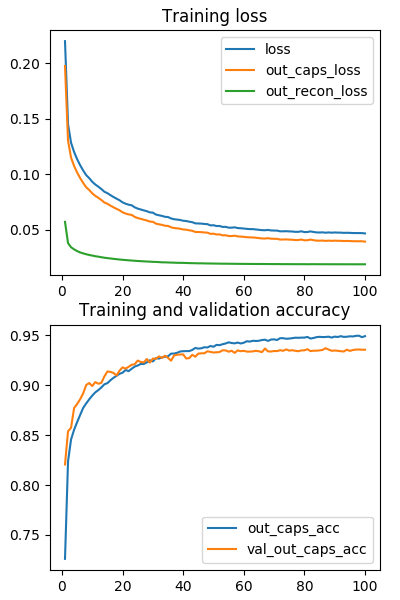
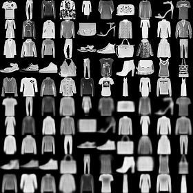

# CapsNet-Fashion-MNIST
[](https://github.com/XifengGuo/CapsNet-Keras/blob/master/LICENSE)

A Keras implementation of CapsNet in the paper:   
[Sara Sabour, Nicholas Frosst, Geoffrey E Hinton. Dynamic Routing Between Capsules. NIPS 2017](https://arxiv.org/abs/1710.09829)

This code is adopted from [CapsNet-Keras](https://github.com/XifengGuo/CapsNet-Keras.git) to test
the performance of CapsNet on [Fashion-MNIST](https://github.com/zalandoresearch/fashion-mnist)

**Contacts**  
[Xifeng Guo](https://xifengguo.github.io/)  
E-mail `guoxifeng1990@163.com` or WeChat `wenlong-guo`.


## Usage

**Step 1.
Install [Keras 2.0.9](https://github.com/fchollet/keras) 
with [TensorFlow](https://github.com/tensorflow/tensorflow) backend.**
```
pip install tensorflow-gpu
pip install keras==2.0.9
```

**Step 2. Clone this repository to local.**
```
git clone https://github.com/XifengGuo/CapsNet-Fashion-MNIST.git
cd CapsNet-Fashion-MNIST
```

**Step 3. Train a CapsNet on Fashion-MNIST**  

Training with default settings:
```
$ python capsulenet.py
```
Data preprocessing: 
- scale pixel values to `[0,1]`; 
- shift 2 pixels and horizontal flipping augmentation. 
## Results

**Accuracy**   

Test Accuracy: `93.62%`
   
Losses and accuracies:   



**Training Speed**  

About `120s / epoch` on a single GTX 1070 GPU.   


**Reconstruction result**  

Top 5 rows are real images from MNIST and 
Bottom are corresponding reconstructed images.



